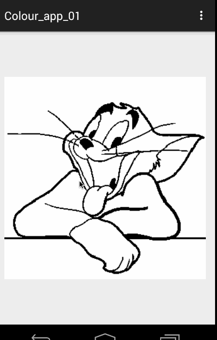

# ColorImageView
Android 图片不规则封闭区域填充 ~~~


## 效果图 





## How to Use

```xml

    <com.zhy.colourimage.ColourImageView
        zhy:border_color="#FF000000"
        android:src="@drawable/image_007"
        android:background="#33ff0000"
        android:layout_width="match_parent"
        android:layout_centerInParent="true"
        android:layout_height="match_parent"/>

```

声明下就Ok~~~


## 关于我

* [我的博客地址][3]
* [我的Android进阶视频](http://www.imooc.com/space/teacher/id/320852)


[3]: http://blog.csdn.net/lmj623565791
